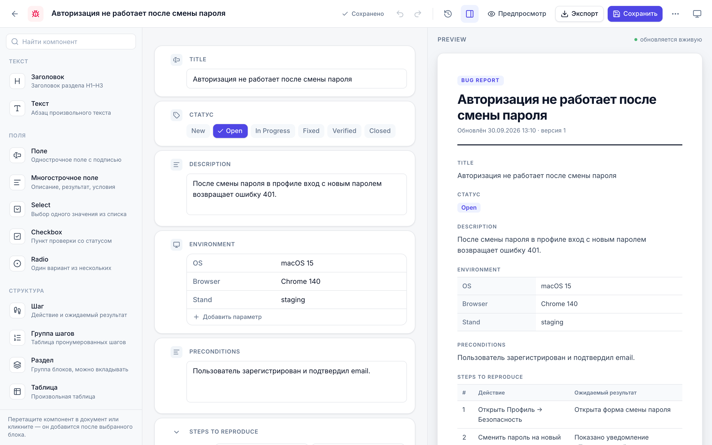
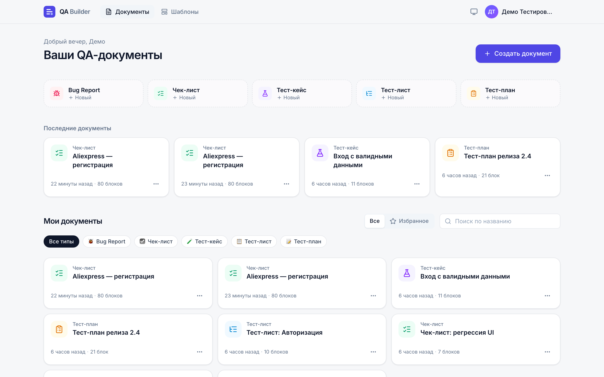
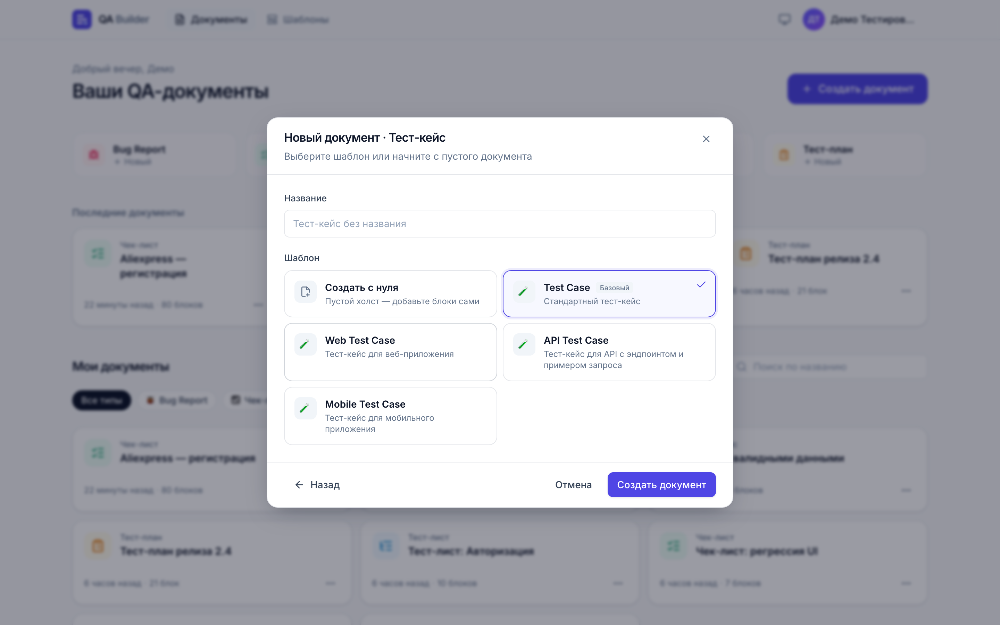
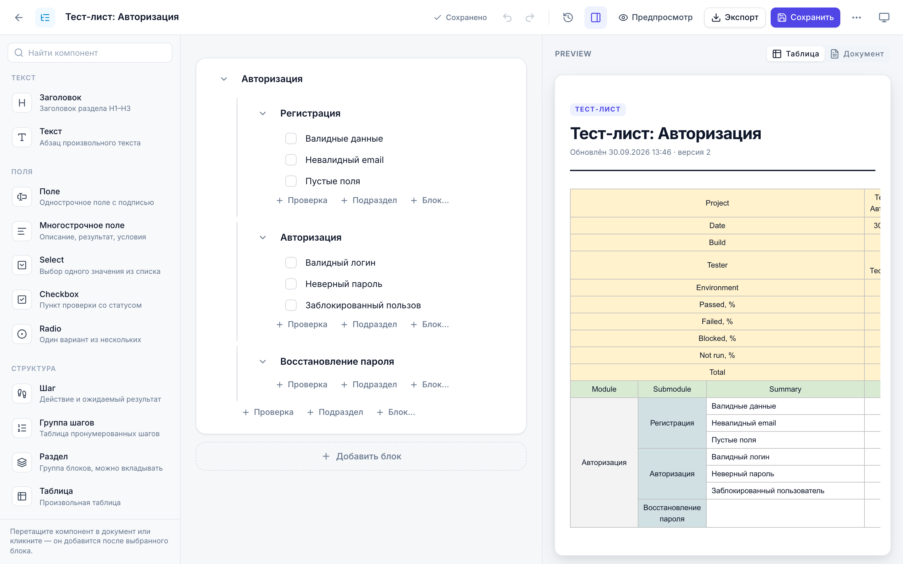
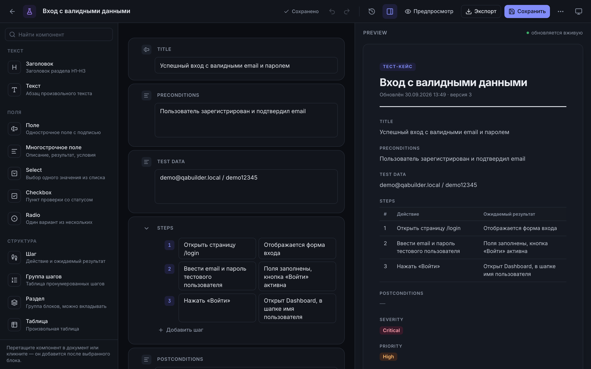
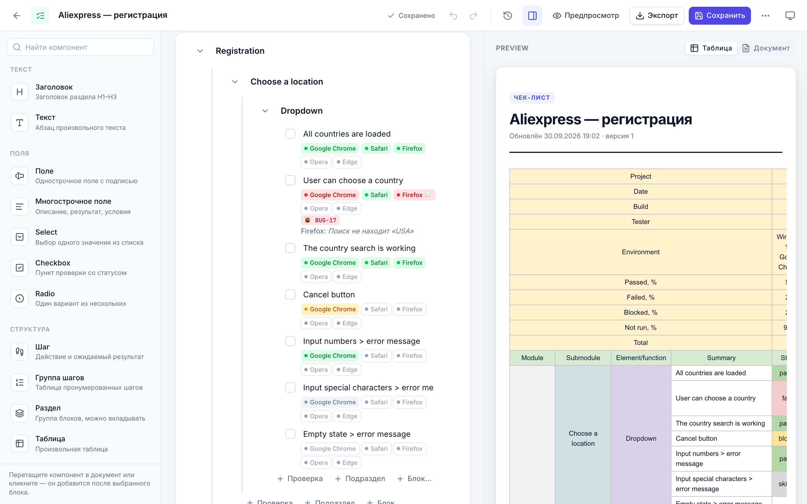
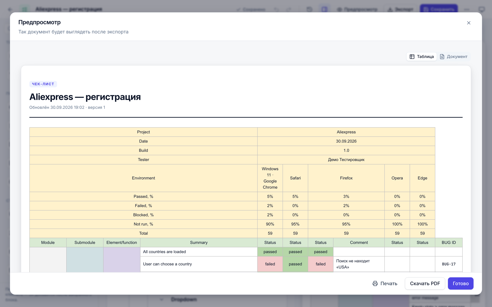
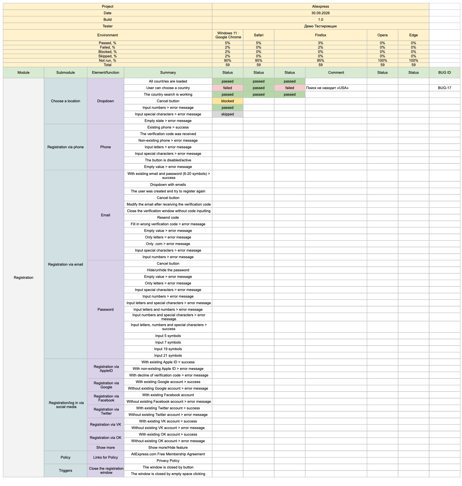
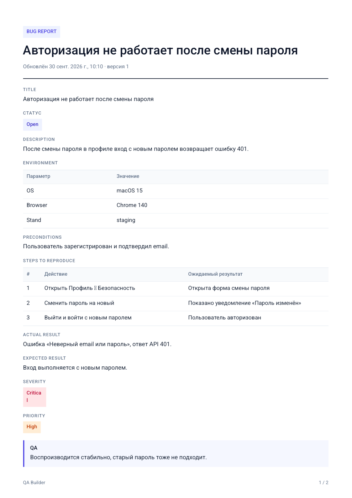
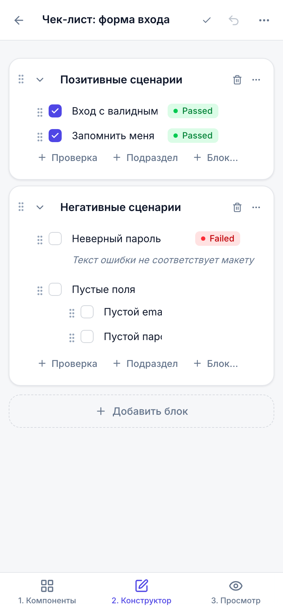

# QA Builder

**QA Builder — визуальный конструктор QA-документации.** Тестировщик собирает документ из готовых блоков (поля, шаги, чекбоксы, разделы, таблицы, Severity/Priority, Environment…), а приложение в реальном времени формирует аккуратный профессиональный документ и экспортирует его в PDF, DOCX, Markdown или JSON.



## Содержание

- [Возможности](#возможности)
- [Скриншоты](#скриншоты)
- [Архитектура](#архитектура)
- [Технологии](#технологии)
- [Быстрый старт](#быстрый-старт)
- [Переменные окружения](#переменные-окружения)
- [База данных, миграции, seed](#база-данных-миграции-seed)
- [API](#api)
- [Тестирование](#тестирование)
- [Docker](#docker)
- [Структура проекта](#структура-проекта)

## Возможности

**5 типов документов** — у каждого свой стартовый набор блоков, который можно менять:

| Тип | Что внутри по умолчанию |
| --- | --- |
| 🐞 Bug Report | Title, Статус, Description, Environment, Preconditions, Steps to Reproduce, Actual/Expected Result, Severity, Priority, Attachments, Comments |
| ☑️ Чек-лист | Module › Submodule › Element › проверки, статус на каждое окружение (Chrome, Safari, Firefox…), комментарии, Bug ID, вложенные пункты |
| 🧪 Тест-кейс | Title, Preconditions, Test Data, пронумерованные шаги (действие + ожидаемый результат), Postconditions, Priority, Severity, Environment |
| 📋 Тест-лист | Иерархия разделов и проверок, тип теста (Smoke/MAT) и требование у каждой проверки, несколько прогонов, сворачивание разделов |
| 📝 Тест-план | Цель, область, объект, функциональность, стратегия, виды тестирования, окружение, данные, риски, критерии, команда, сроки |

**Визуальный конструктор**
- 3 панели: компоненты → конструктор → живой preview; на мобильных — последовательные вкладки.
- 19 типов блоков, drag-and-drop из палитры и между блоками (включая перенос во вложенные разделы) с индикатором вставки.
- Клик по компоненту добавляет его после выбранного блока (или внутрь выбранного контейнера).
- Действия блока при наведении и в контекстном меню (ПКМ): редактировать, дублировать, удалить, вверх/вниз, вложить/вынести.
- Подписи полей редактируются прямо в карточке; у Select/Radio/Status — редактор вариантов; пресеты Environment (Web/Mobile/API).
- Изображения: загрузка, drag-and-drop файла, вставка скриншота из буфера (Ctrl+V).
- Горячие клавиши: `Ctrl/Cmd+S` — сохранить с версией, `Ctrl/Cmd+Z` / `Ctrl/Cmd+Shift+Z` — undo/redo, `Delete` — удалить блок, `Ctrl/Cmd+D` — дублировать, `Alt+↑/↓` — переместить.

**Данные не теряются**
- Автосохранение с debounce (1 c) и индикатором «Сохранено / Сохранение… / Не сохранено».
- Резервная копия несохранённых изменений в `localStorage` — после сбоя сети или закрытия вкладки черновик восстанавливается автоматически.
- Сохранение при уходе со страницы, предупреждение `beforeunload`, автоповтор при ошибке.
- Удаление блока всегда отменяемо (toast «Отменить» + Ctrl+Z).

**История версий** — версия создаётся при ручном сохранении и автоматически раз в 10 минут работы; одинаковое содержимое не дублируется. Любую версию можно открыть и восстановить.

**Шаблоны** — системные (Web/Mobile/API Bug, Web/API/Mobile Test Case, чек-листы Авторизация/Регистрация/UI/API…) и пользовательские. Шаблон можно создать с нуля, из документа («Сохранить как шаблон») и редактировать в том же конструкторе.

**Dashboard** — последние документы, поиск, фильтр по типу, избранное, дублирование, удаление с подтверждением.

**Прогоны и окружения (как в QA-таблицах)** — блок «Прогоны и окружения» задаёт Project, Tester и список прогонов (окружение, дата, build, тип теста). Каждое окружение становится отдельной колонкой статуса: у проверки появляются плашки Chrome / Safari / Firefox…, по клику — статус и комментарий для этого окружения. Прогресс по каждому окружению считается на лету.

**Табличный вид** — чек-листы и тест-листы в preview показываются так же, как в Excel: шапка Project / Date / Build / Tester / Environment, статистика Passed / Failed / Blocked / Not run, колонки Module › Submodule › Element/function › Summary › Status с объединёнными ячейками. Статус можно проставить кликом прямо по ячейке таблицы.

**Экспорт**
- **Excel (XLSX)** — в формате классической QA-таблицы:
  - чек-лист / тест-лист → лист с шапкой, статистикой (живые формулы `COUNTIF`), объединёнными ячейками Module / Submodule / Element, статусом по каждому окружению (выпадающий список + цвет, который меняется при правке в Excel), колонками Comment, Test Type, Requirements, BUG ID;
  - тест-кейсы → таблица `ID | Summary | Pre-conditions | Test data | Steps | Expected results | Post-conditions | Priority | Severity | Environment` (одна строка на кейс);
  - баг-репорты → таблица `ID | Summary | Status | Severity | Priority | Description | Environment | Steps | Actual | Expected | Attachments | Comments`;
  - тест-план → лист «параметр → значение» с таблицами.
- **Массовый экспорт** — отметьте несколько документов на Dashboard → «Экспорт в Excel»: одна книга, где все тест-кейсы собраны в одну таблицу, а каждый чек-лист — на своём листе.
- **PDF / DOCX** — для чек-листов та же таблица (альбомная ориентация при множестве окружений), для остальных — оформленный документ; **Markdown** (GFM-таблицы), **JSON**.

**Роли** — `user` работает со своими документами и шаблонами; `admin` дополнительно управляет пользователями и системными шаблонами и видит статистику. Админ-панель скрыта от обычных пользователей.

**Интерфейс** — русский язык, светлая/тёмная/системная тема, адаптивность от телефона до широкого монитора.

## Скриншоты

| Dashboard | Создание документа |
| --- | --- |
|  |  |

| Тест-лист (иерархия) | Тёмная тема |
| --- | --- |
|  |  |

| Статусы по окружениям | Табличный предпросмотр |
| --- | --- |
|  |  |

| Экспорт в Excel | Экспорт в PDF |
| --- | --- |
|  |  |

| Мобильная версия |
| --- |
|  |

Скриншоты генерируются скриптом `node e2e/scripts/screenshots.mjs` (при запущенном `npm run dev`).

## Архитектура

```
┌──────────────── frontend (React + Vite) ─────────────────┐
│ Palette ─drag/click─▶ Builder store (Zustand)             │
│                         │  flat Block[] + undo/redo       │
│                         ├─▶ Canvas  (BlockCard → editors) │
│                         ├─▶ Preview (same tree, read-only)│
│                         └─▶ Autosave (debounce + draft)   │
└───────────────────────────┬──────────────────────────────┘
                            │ REST /api  { data, error }
┌──────────────── backend (Express) ───────────────────────┐
│ routes → middleware (auth, zod) → controllers → services  │
│                                     │                     │
│                   domain: blockTypes, blockTree,          │
│                   blueprints, export renderers            │
│                                     ▼                     │
│                          repositories (Prisma)            │
└───────────────────────────┬──────────────────────────────┘
                            ▼
                PostgreSQL (content/settings — JSONB)
```

**Главный принцип — единая система блоков, а не пять редакторов.** Любой документ — это плоский список `DocumentBlock { id, documentId, type, order, parentId, content, settings }`. Тип документа лишь определяет стартовый набор блоков (blueprint → системный шаблон). `content` и `settings` хранятся в JSONB, поэтому новый вид блока не требует новой таблицы.

- **Правила вложенности** (`ALLOWED_CHILDREN`) едины для клиента и сервера: `SECTION` принимает любые блоки, `STEP_GROUP` — только `STEP`, `CHECKBOX` — вложенные `CHECKBOX`.
- **Сервер — источник истины:** `normalizeBlocks` проверяет каждый блок по zod-схеме его типа, наличие родителя, допустимость вложенности, отсутствие циклов, и нормализует порядок.
- **Реестр блоков на фронтенде** (`frontend/src/blocks/registry.ts`) описывает каждый тип: иконка, категория, контент по умолчанию, настройки. Редакторы (`blocks/editors`) и preview (`blocks/preview`) — отдельные слои.
- **Экспорт** строит общую модель документа (`services/export/model.js`), а рендереры PDF/DOCX/Markdown используют одну цветовую тему (`theme.js`), совпадающую с preview.
- **Таблица чек-листа** (`services/export/checklistTable.js`, на клиенте — `lib/checklistTable.ts`) — единая модель «Module › Submodule › Element › Summary › Status по прогонам», из которой строятся Excel-лист, PDF/DOCX/Markdown-таблицы и табличный preview, поэтому они всегда совпадают.
- **Прогоны** (`domain/runs.js`, `lib/runs.ts`): результат первого прогона хранится в собственных полях проверки (`status`, `comment`) — старые документы остаются валидными; остальные — в `results[runId]`. При удалении или перестановке окружений результаты переназначаются так, что не «переезжают» в чужую колонку.
- **Версии** — снимки блоков в `DocumentVersion.snapshot`; сравнение идёт по канонической сериализации (JSONB не сохраняет порядок ключей).

### Модели БД

`User`, `Document`, `DocumentBlock`, `DocumentVersion`, `Template`, `TemplateBlock`, `Attachment`, `DocumentFavorite` — см. [`backend/prisma/schema.prisma`](backend/prisma/schema.prisma).

## Технологии

| Слой | Стек |
| --- | --- |
| Frontend | React 19, TypeScript, Vite 7, Tailwind CSS 4, Zustand, dnd-kit, React Router 7, lucide-react, sonner |
| Backend | Node.js 22+, Express 5, Prisma 6, PostgreSQL 16, JWT, bcrypt, zod, multer |
| Экспорт | exceljs (XLSX), pdfmake (Roboto с кириллицей), docx |
| Тесты | Vitest, Supertest, Playwright |
| Инфраструктура | Docker, docker-compose, nginx |

## Быстрый старт

Требуется **Node.js 22+** и **PostgreSQL 14+**.

```bash
npm install
```

Скопируйте переменные окружения и укажите свою строку подключения к PostgreSQL:

```bash
cp backend/.env.example backend/.env
```

Создайте базу, примените миграции и заполните данные (админ, демо-пользователь, системные шаблоны):

```bash
createdb qa_builder
```

```bash
npm run setup
```

Запустите backend и frontend одной командой:

```bash
npm run dev
```

- Frontend: http://localhost:5173 (запросы `/api` проксируются на backend)
- Backend API: http://localhost:4000/api

Учётные записи после seed:

| Роль | Email | Пароль |
| --- | --- | --- |
| user (с демо-документами) | `demo@qabuilder.local` | `demo12345` |
| admin | `admin@qabuilder.local` | `admin12345` |

### Отдельные команды

| Команда | Что делает |
| --- | --- |
| `npm run dev -w backend` | API с автоперезапуском (`node --watch`) |
| `npm run dev -w frontend` | Vite dev server |
| `npm run build` | Production-сборка frontend (`frontend/dist`) |
| `npm run db:migrate` | `prisma migrate dev` |
| `npm run db:seed` | Seed (идемпотентный) |
| `npm run db:seed:refresh -w backend` | Seed + обновить блоки системных шаблонов до актуальных (перезаписывает правки админа) |
| `npm run db:deploy -w backend` | Применить миграции без генерации новых |
| `npm test` | Unit + API тесты backend и unit-тесты frontend |
| `npm run test:e2e` | Playwright E2E |
| `npm run lint:types` | Проверка типов TypeScript |

## Переменные окружения

`backend/.env` (шаблон — `backend/.env.example`):

| Переменная | По умолчанию | Описание |
| --- | --- | --- |
| `DATABASE_URL` | — | Строка подключения PostgreSQL |
| `JWT_SECRET` | — | Секрет подписи JWT (обязательно смените в production) |
| `JWT_EXPIRES_IN` | `7d` | Время жизни токена |
| `API_PORT` | `4000` | Порт API |
| `CORS_ORIGIN` | `http://localhost:5173` | Разрешённые origin через запятую |
| `UPLOAD_DIR` | `uploads` | Каталог для загруженных файлов |
| `ADMIN_EMAIL` / `ADMIN_PASSWORD` | `admin@qabuilder.local` / `admin12345` | Администратор, создаваемый seed-скриптом |

Frontend (необязательно):

| Переменная | По умолчанию | Описание |
| --- | --- | --- |
| `VITE_API_PROXY` | `http://localhost:4000` | Куда dev-сервер Vite проксирует `/api` и `/uploads` |
| `VITE_API_URL` | `/api` | Базовый URL API в браузере |

Тесты: `backend/.env.test` (шаблон `.env.test.example`) и `e2e/.env.e2e` (шаблон `.env.e2e.example`).

## База данных, миграции, seed

- Схема: `backend/prisma/schema.prisma`, миграции: `backend/prisma/migrations`.
- Новая миграция после изменения схемы: `npm run db:migrate -- --name <имя>`.
- Production / CI: `npm run db:deploy -w backend` — только применяет существующие миграции.
- Seed (`backend/prisma/seed.js`) идемпотентен: создаёт админа и демо-пользователя, если их нет; добавляет недостающие системные шаблоны, не затирая правки администратора; демо-документы (включая кросс-браузерный чек-лист) создаются только для пустого аккаунта. После обновления приложения системные шаблоны можно освежить командой `npm run db:seed:refresh -w backend`.

## API

Базовый путь — `/api`. Авторизация — заголовок `Authorization: Bearer <token>`.
Все ответы (кроме файлов экспорта) имеют единый формат:

```json
{ "data": { }, "error": null }
```

```json
{ "data": null, "error": "Описание ошибки" }
```

| Метод | Путь | Описание |
| --- | --- | --- |
| POST | `/auth/register` | Регистрация `{ email, name, password }` → `{ token, user }` |
| POST | `/auth/login` | Вход `{ email, password }` → `{ token, user }` |
| GET | `/auth/me` | Текущий пользователь |
| GET | `/documents?search=&type=&favorite=true&limit=` | Мои документы |
| POST | `/documents` | Создать `{ type, title?, templateId?, blank? }` |
| GET | `/documents/:id` | Документ с блоками |
| PUT | `/documents/:id` | Сохранить `{ title?, blocks?, createVersion? }` (используется автосохранением) |
| DELETE | `/documents/:id` | Удалить |
| POST | `/documents/:id/duplicate` | Дублировать |
| POST / DELETE | `/documents/:id/favorite` | Добавить / убрать из избранного |
| POST | `/documents/:id/blocks` | Добавить блок `{ type, parentId?, order?, content?, settings? }` |
| PUT | `/documents/:id/blocks/:blockId` | Изменить `content` / `settings` (merge) |
| DELETE | `/documents/:id/blocks/:blockId` | Удалить блок вместе с вложенными |
| PUT | `/documents/:id/blocks/reorder` | `{ items: [{ id, parentId, order }] }` |
| GET | `/documents/:id/versions` | Список версий |
| GET | `/documents/:id/versions/:versionId` | Снимок версии |
| POST | `/documents/:id/export/{xlsx,pdf,docx,markdown,json}` | Файл экспорта |
| POST | `/documents/export/xlsx` | Несколько документов в одной книге Excel: `{ ids: [...] }` |
| POST | `/documents/:id/attachments` | Загрузка файла (`multipart/form-data`, поле `file`, до 10 МБ) |
| GET | `/templates?docType=` | Системные + мои шаблоны |
| POST | `/templates` | Создать `{ name, docType, description?, blocks? \| fromDocumentId?, isSystem? }` |
| GET / PUT / DELETE | `/templates/:id` | Получить / изменить / удалить |
| GET | `/admin/stats` | Статистика (admin) |
| GET | `/admin/users` | Пользователи (admin) |
| PATCH | `/admin/users/:id` | Сменить роль `{ role: "USER" \| "ADMIN" }` (admin) |
| DELETE | `/admin/users/:id` | Удалить пользователя (admin) |

Пример:

```bash
curl -s -X POST http://localhost:4000/api/auth/login -H 'Content-Type: application/json' -d '{"email":"demo@qabuilder.local","password":"demo12345"}'
```

## Тестирование

| Уровень | Где | Что покрыто |
| --- | --- | --- |
| Unit (backend) | `backend/tests/unit` | Валидация и нормализация дерева блоков, правила вложенности, все blueprints, Markdown-рендер, Excel (читается обратно: объединения, статусы, формулы), табличная модель чек-листа, результаты прогонов, заголовки скачивания, `ok()/fail()` |
| API (backend) | `backend/tests/api` | Auth, CRUD документов, блоки (добавление, вложенность, reorder, циклы), шаблоны и права, версии, экспорт XLSX/PDF/DOCX/MD/JSON и массовый экспорт, загрузка файлов, админка |
| Unit (frontend) | `frontend/src/**/*.test.ts` | Операции над деревом (insert/move/indent/duplicate/нумерация шагов), store: undo/redo, объединение ввода, статус сохранения; прогоны (перенос результатов при удалении окружения), табличная модель |
| E2E | `e2e/tests` | Регистрация, валидация, вход/выход, создание Bug Report, заполнение, добавление шага и блока, drag-and-drop (порядок и палитра), Ctrl+S → версия, повторное открытие, undo, история версий, экспорт PDF, Markdown и Excel (с проверкой содержимого файла), статусы по окружениям и клик по ячейке таблицы, массовый экспорт с Dashboard, избранное/дублирование/удаление |

API-тестам нужна отдельная база (по умолчанию `qa_builder_test`, см. `backend/.env.test.example`), E2E — `qa_builder_e2e`. Настройка тестов недеструктивна: применяются миграции и идемпотентный seed, каждый тест создаёт своих пользователей.

```bash
createdb qa_builder_test && createdb qa_builder_e2e
```

```bash
npm test
```

```bash
npx playwright install chromium
```

```bash
npm run test:e2e
```

Playwright сам поднимает backend (порт 4100) и frontend (порт 5174), не мешая dev-серверу.

## Docker

Поднять PostgreSQL, backend и frontend одной командой:

```bash
docker compose up --build
```

- Приложение: http://localhost:8080 (nginx отдаёт SPA и проксирует `/api`, `/uploads` на backend)
- API: http://localhost:4000/api
- PostgreSQL: `localhost:5433` (`postgres` / `postgres`)

При старте backend автоматически применяет миграции и seed. Загруженные файлы и данные БД хранятся в volumes `uploads` и `db-data`. Секреты можно передать через окружение: `JWT_SECRET=... ADMIN_PASSWORD=... docker compose up --build`.

## Структура проекта

```
.
├── backend/
│   ├── prisma/                 # schema.prisma, migrations, seed.js
│   ├── src/
│   │   ├── controllers/        # HTTP-слой: разбор запроса → сервис → ok()
│   │   ├── routes/             # маршруты + валидация zod
│   │   ├── services/           # бизнес-логика (документы, шаблоны, версии, экспорт)
│   │   │   └── export/         # модель документа, PDF/DOCX/Markdown рендереры, тема
│   │   ├── repositories/       # доступ к данным через Prisma
│   │   ├── middleware/         # auth (JWT, роли), validate, upload, errorHandler
│   │   ├── domain/             # типы блоков, правила дерева, blueprints документов
│   │   ├── validators/         # zod-схемы запросов
│   │   ├── utils/              # ok/fail, HttpError, config, jwt, password
│   │   ├── app.js
│   │   └── server.js
│   └── tests/                  # unit + API (Vitest, Supertest)
├── frontend/
│   └── src/
│       ├── api/                # клиент с конвертом { data, error }
│       ├── blocks/             # реестр блоков, редакторы, настройки, preview
│       ├── components/         # UI-кит и лейауты
│       ├── features/           # auth, dashboard, builder, templates, admin
│       ├── lib/                # дерево блоков, утилиты, справочники
│       └── stores/             # auth, theme
├── e2e/                        # Playwright
├── docs/screenshots/
└── docker-compose.yml
```
